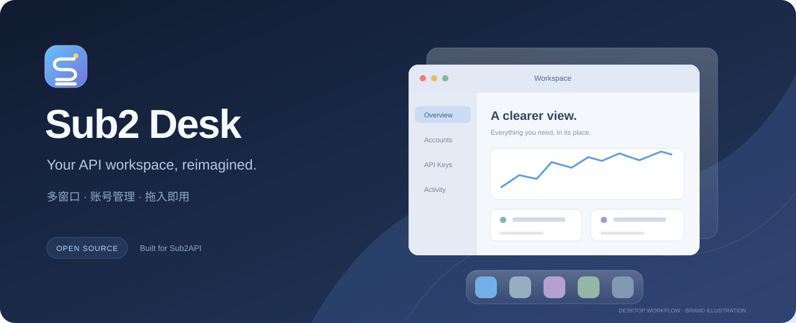

<div align="center">



**把 API 管理，变成一张顺手的桌面。**

兼容 Sub2API 的独立桌面式控制台 · Vue 3 · 多窗口 · 拖拽导入 · 浅深色

[](https://github.com/atuizz/sub2-desk/actions/workflows/ci.yml)
[](https://github.com/atuizz/sub2-desk/releases)
[](LICENSE)

[一键安装](#一键安装) · [功能一览](#功能一览) · [日常管理](#日常管理) · [开发](#本地开发) · [下载](https://github.com/atuizz/sub2-desk/releases)

</div>

---

Sub2 Desk 把账号、密钥、用量和运营工具放进同一套桌面工作流：从 Dock 打开应用，把账号 JSON 拖入窗口，在多个任务之间切换。业务由官方 Sub2API 后端提供。

封面为原创品牌示意。公开发行使用独立设计的图标与壁纸；项目与 Apple、Sub2API 官方没有隶属关系。

## 一键安装

在 **Linux 服务器终端**复制执行：

```bash
curl -fsSL https://raw.githubusercontent.com/atuizz/sub2-desk/v1.1.0/deploy/install.sh | bash
```

安装器会自动：

1. 检查 Docker；Linux 未安装时调用 Docker 官方安装器（需要 root 或 sudo）。
2. 生成管理员密码、数据库密码和持久化密钥。
3. 启动 **Sub2 Desk + 官方 Sub2API 0.2.4 + PostgreSQL + Redis**。
4. 等待服务健康，显示访问地址、管理员账号与初始密码。

打开 **`http://服务器IP:8080`**，使用终端显示的账号密码登录。首次构建需要下载镜像和依赖，请预留几分钟。建议准备 **2 核 / 4 GB 内存**及可访问 GitHub、Docker Hub、npm 的网络；这不是经过压测的最低配置。

<details>
<summary><b>换端口、指定目录、Windows/macOS</b></summary>

默认安装到 `~/sub2-desk`，默认端口 `8080`。改为 `8090`：

```bash
curl -fsSL https://raw.githubusercontent.com/atuizz/sub2-desk/v1.1.0/deploy/install.sh | SUB2_DESK_PORT=8090 bash
```

指定目录：在 `bash` 前增加 `SUB2_DESK_INSTALL_DIR=/你的目录`。首次生成后以该目录 `.env` 为准，重复执行保留密码与数据；修改端口请编辑 `.env` 后重新执行安装命令。

Windows 请在已启用 Docker Desktop 集成的 WSL2 终端执行；macOS 请先安装并启动 Docker Desktop。完整自动验收环境为 Linux amd64，其他平台尚未做同等验收。

</details>

> 公网使用请配置域名和 HTTPS，并仅放行需要的 Web 端口。安装器不自动申请证书；数据库、Redis 和后端不直接映射宿主机端口。

## 功能一览

| 工作场景 | Sub2 Desk 提供什么 |
| :-- | :-- |
| **像桌面一样操作** | Dock、启动台、多窗口、拖动缩放、快捷键、浅深色与紧凑布局 |
| **管理多平台账号** | 平台辨识、分屏创建向导、OAuth 链接复制、JSON 拖入与导入预览 |
| **日常 API 使用** | 密钥、用量、请求详情、分页 CSV 导出、模型目录、批量生图 |
| **运营与权限** | 用户、分组、渠道、订阅、代理、公告、订单与运维视图 |
| **充值与小铺** | 支付配置、兑换码、店铺应用；不支持内嵌的站点可外部打开 |
| **减少误操作** | 草稿离开提醒、提交防重、身份切换隔离、未知写入结果核对 |

26 个核心应用，小铺按配置启用。具体实现与边界见 [官方功能对照](docs/frontend/UPSTREAM_PARITY.md)。支付、邮件和第三方 OAuth 已有接口实现，未完成供应商实联验收；不宣称任意渠道开箱即用。

## 日常管理

以下命令按默认安装目录举例：

```bash
# 查看状态
bash ~/sub2-desk/manage.sh ps
# 查看日志
bash ~/sub2-desk/manage.sh logs --tail 100
# 重启服务
bash ~/sub2-desk/manage.sh restart
# 停止服务，保留数据
bash ~/sub2-desk/manage.sh stop
# 再次启动
bash ~/sub2-desk/manage.sh up -d --wait
```

**数据在哪里？** 数据库存储在 Docker 命名卷；密钥和初始登录信息保存在安装目录 `.env`，权限为 `600`。管理员改过密码后，以新密码为准。请同时备份数据库、后端数据卷和 `.env`；不要执行 `down -v`，它会删除数据卷。

**重复运行会升级吗？** 此命令固定安装 1.1.0，重复执行保留配置与数据，不自动追随上游 `latest`。升级前先备份并阅读目标版本说明。容器后端升级通过镜像版本与 Compose 管理，前端不承诺用网页按钮升级整套容器。

## 已有 Sub2API 后端？

也可以只安装前端：

```bash
git clone https://github.com/atuizz/sub2-desk.git
cd sub2-desk
cp deploy/.env.example deploy/.env
# 编辑 deploy/.env，把 SUB2API_UPSTREAM 改为容器可达的后端地址
docker compose -f deploy/docker-compose.yml --env-file deploy/.env up -d --build
```

静态托管请下载 Release 中的 `static.tar.gz`，只将 `html/` 作为 Web 根目录，并转发 API/安装接口。详见 [部署说明](deploy/README.md)。

## 本地开发

需要 Node.js 24、pnpm 10.28.2，业务页面需连接 Sub2API：

```bash
git clone https://github.com/atuizz/sub2-desk.git
cd sub2-desk
corepack enable
corepack prepare pnpm@10.28.2 --activate
pnpm install --frozen-lockfile
cp packages/sub2-console/.env.example packages/sub2-console/.env.local
pnpm dev
```

打开 `http://127.0.0.1:5173`。在 `.env.local` 中设置 `SUB2API_DEV_TARGET`，默认为 `http://127.0.0.1:8000`。`/?ui-lab` 提供不依赖业务账号的组件预览。

```bash
pnpm typecheck
pnpm test
pnpm build:release
pnpm package:release
```

## 验证与发行

[GitHub Actions](https://github.com/atuizz/sub2-desk/actions) 包含类型检查、1061 项回归、发行构建、前端容器转发检查，以及全栈首次安装、真实管理员登录、容器重建与配置保留验证。各环境的通过/跳过数量和实际结果见 [执行记录](docs/frontend/EXECUTION_PLAN.md)。

后端兼容基线固定为 **0.2.4**。第三方渠道、HTTPS/公网拓扑、其他架构与生产负载不由 CI 冒烟检查替代。源码包和静态包附 SHA-256 校验；公开包不包含运行数据、本地配置、预设密码或本地 Apple 素材。

## 参与项目

- 问题反馈：[Issues](https://github.com/atuizz/sub2-desk/issues) · 贡献说明：[CONTRIBUTING](CONTRIBUTING.md)
- 安全问题：[私密报告](https://github.com/atuizz/sub2-desk/security/advisories/new) · [安全政策](SECURITY.md)
- 品牌：[Sub2 Desk](docs/BRAND.md) · 上游：[Sub2API](https://github.com/Wei-Shaw/sub2api)

以 **LGPL-3.0-only** 开源。许可与来源见 [LICENSE](LICENSE)、[NOTICE](NOTICE.md) 和 [第三方声明](THIRD_PARTY_NOTICES.md)。
