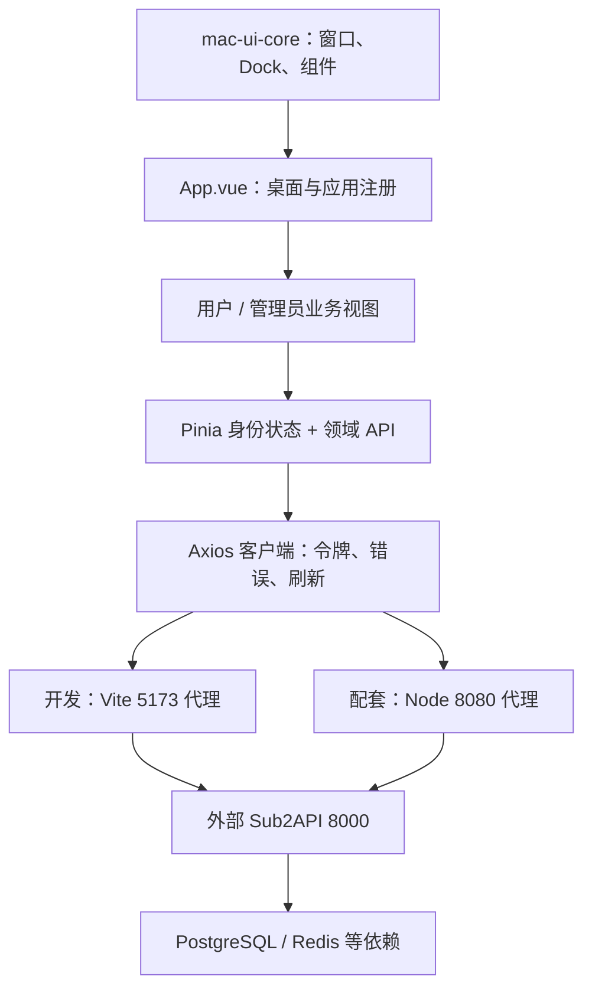

# Sub2-Mac 项目审阅报告

审阅日期：2026-09-08。范围：`D:\sub2-mac` 当前目录快照。后续执行依据：[改造优化方案](REFACTOR_PLAN.md)。

## 结论

项目约 **4.2 万行主线应用源码，属于中等规模前端控制台**。Vue 桌面、多窗口交互、领域 API 适配和业务页面已经成形；认证、支付、设置保存及部署仍存在明确断点。

建议定位为 **“面向 Sub2API 运营者与 API 使用者的 macOS 风格 Web 控制台”**。内部桌面组件包具有复用价值，但尚未验证为独立通用框架。附带网关和启动脚本属于配套设施，不能据此宣称拥有完整后端内核或完整商业交付能力。

**判断：可以继续增量开发；当前快照不具备直接公网商业交付条件。** 类型和构建通过说明前端可编译，不能消除下面已确认的运行逻辑问题。

## 范围、规模与证据口径

统计 `.ts/.vue/.js/.css/.html/.ps1` 物理行，包含注释和空行；不把依赖、产物、图片、二进制、运行日志和数据计入主线源码。

| 范围 | 文件数 | 物理行 | 说明 |
| --- | ---: | ---: | --- |
| `packages/sub2-console/src` | 106 | 38,323 | 包含业务视图、API、类型、状态和桌面组件 |
| `packages/mac-ui-core/src` | 27 | 3,542 | 组件、窗口与交互逻辑 |
| `server/gateway.js` | 1 | 167 | HTTP 网关 |
| `scripts/start-all.ps1` | 1 | 41 | 开发启动器 |
| **主线合计** | **135** | **42,073** | 不等同于纯业务逻辑行数 |
| 根目录旧原型：`index.html/js/css` | 16 | 10,600 | 不计入主线 |
| `archive-prototype` 旧原型 | 16 | 10,600 | 与上面 16 个源码文件逐文件哈希完全相同 |

其他事实：

- 注册表有 24 个入口：23 个 Vue 应用组件与一个启动台入口。分类为 11 个 admin 和 13 个 user，后者包括启动台及工具。
- `api/` 有 58 个 TypeScript 文件、13,596 行；数量不等于已经验收的 API 或业务能力数量。
- `SettingsApp.vue` 3,381 行，`ActivityApp.vue` 1,859 行，`CommerceApp.vue` 1,572 行，领域逻辑集中度较高。
- 主线 `public/assets` 有 77 个文件；根目录 assets 有 44 个。重名 44 个中仅 37 个内容相同，不能盲目合并。
- 此目录不是可识别的 Git 工作树，未发现项目级自动化测试套件、CI 工作流和根目录许可文件。此结论针对交付快照，不代表上游项目没有这些内容；随包 ZIP 内另有许可及文档。
- 未发现 Go 源码；不能审查外部内核中的真实授权、支付验签、调度、账务或数据库实现。

审阅覆盖主线入口、组件层、全部应用分类、API 分层、关键调用链、网关、配置、脚本、归档及交付文件。对高风险路径进行了专项核验；没有把逐接口端到端验收或二进制源码审计声称为已完成。

## 定位校正

| 原说明中的主张 | 本次校正 | 依据 |
| --- | --- | --- |
| macOS 网页版商业中台、通用管理框架 | Sub2API 专用桌面风格控制台；组件复用为后续方向 | 业务 API 和界面深度绑定 Sub2API，core 仍含业务菜单、品牌和资源约定 |
| 统一入口是根目录 `index.html` | 当前开发主线是 `packages/sub2-console` | 根 `package.json` 脚本及 Vite 配置 |
| 16 款原生应用 | 24 个浏览器桌面入口、23 个 Vue 应用组件 | `apps/manifest.ts` |
| 最新官方内核、零修改、替换即升级 | 外部后端依赖；来源和兼容版本待明确 | 无 Go 源码，二进制/镜像未形成完整来源和兼容清单 |
| 安全收银台、完整订阅购买 | 订单接口已有接入，支付/订阅/退款交互未闭环 | Wallet 状态没有对应付款模板，订阅按钮无动作 |
| 实时 WebSocket 运维控制台 | 当前运维 App 主要每 60 秒轮询概览 | `OpsApp.vue:42`；客户端虽有 WebSocket 适配器但未形成对应 UI |
| 模型广场内置流式 Playground | 目录、价格、分组及筛选 | `AppStoreApp.vue` 无对应推理交互 |
| 所有业务均可离线仿真并持久化 | 旧静态原型具有 Mock；主线要求真实认证 | `stores/auth.ts:35` 清理 mock token |
| Docker 一键全栈生产交付 | 尚待修复的编排草案 | 工作目录挂载、浮动镜像、产物/配置/持久化未验收 |

保留的优势：Vue 与 TypeScript 基线可用，窗口和业务已分包，真实接口覆盖面广；请求客户端有结构化错误、令牌刷新合并、跨标签页协调和会话变化保护。应在这些基础上修正业务消费者，不宜全面重写。

## 实际架构与关键调用链



1. **登录与恢复**：`MacLockscreen → authStore → api/auth → apiClient`；恢复调用 `/auth/me`。锁屏未根据公共认证策略完整构造流程。
2. **密钥与用量**：业务视图调用 `keys/groups/usage`；管理员仪表盘另选 admin API。后端负责数据范围和最终权限。
3. **商业链路**：`Commerce 套餐管理 → Wallet checkout-info → createOrder → activeOrder`，前端付款展示和结果确认处缺失；若经 Node 网关收到回调，又会被专用分支截断。
4. **设置**：`getSettings → Object.assign 默认表单 → updateSettings(整对象)`；网关子设置另走四个 API。类型逃逸和错误吞没使编译成功无法证明保存正确。
5. **开发启动**：PowerShell 尝试启动缓存、后端二进制、Vite，不启动 Node 网关；Compose 才使用 Node 网关。开发页面正常不能证明生产代理链正确。

## 能力矩阵

“API 接入”仅指源码已调用真实接口；本次没有真实后端业务验收。以下分类不把 Mock、静态文案或仅有适配器的能力计为闭环。

| 入口 | 实际实现 | 主要边界 |
| --- | --- | --- |
| 访达 | 本地应用导航、搜索、角色过滤 | 不是真实文件管理器 |
| 启动台 | 本地应用启动与搜索 | 特殊入口，无独立业务 App |
| 仪表盘 | 用户/管理员统计、趋势与额度查询 | 部分固定状态需清理，真实数据仍需验收 |
| API 密钥 | 基础 CRUD、分组、IP、额度和时间窗口限额 | 列表固定首 100 条；编辑到期配置未完整提交 |
| 使用记录 | 筛选、分页、统计、错误详情、CSV | CSV 会遍历分页并带 BOM；不存在独立 Numbers 注册项 |
| 可用渠道 | 渠道、模型价格、倍率和监控查询 | 依赖后端支持与用户权限 |
| 我的订阅 | 订阅、额度、有效期展示 | 购买转到钱包，钱包链路尚未完成 |
| 购买与充值 | 收银配置、充值下单、订单取消、返利查询/划转 | 支付展示、终态确认、订阅购买、退款表单缺失 |
| 卡券兑换 | 核销、用户资料刷新、历史 | 当前业务 App 不提供旧版体验码仿真 |
| 模型广场 | 真实目录、价格、分组倍率筛选 | 无宣称的 Playground 和流式测试 |
| Safari | 内置接口说明 | 静态说明与硬编码地址 |
| 终端 | 少量浏览器 GET、账户显示、主题命令 | 非系统 Shell；硬编码 localhost，部分输出模拟 |
| 系统设置 | 资料、密码、管理配置、备份、后端维护 | 字段映射、TOTP 管理、身份绑定、Passkey、前端更新等未完整 |
| 运维监控 | overview 轮询 | 未形成 WebSocket 日志与完整运维工作流 |
| 用户管理 | 用户、角色、余额、并发/RPM、分组授权 | 部分错误只写 console；敏感操作恢复需补齐 |
| 分组管理 | 基础 CRUD、复制、倍率/RPM、启停 | 精细定价和模型路由配置面未完整 |
| 渠道管理 | 基础信息、关联分组、监控配置及触发 | 定价、模型映射字段未完整进入保存载荷 |
| 订阅管理 | 指派、延期、撤销、恢复、重置额度 | 指派候选只加载首 100 个用户 |
| 账号管理 | 列表、编辑、批量、导入导出、CRS 同步 | 多认证类型的手工录入序列化存在错误 |
| 插件管理 | 上传、列表、启停、删除 | 启用参数固定，缺完整配置流程 |
| 公告管理 | 管理端 CRUD、预览 | 用户侧阅读、弹窗和已读没有对应 UI 消费 |
| IP 管理 | 代理增删、启停、批量、探测、质量和关联查询 | 部分错误恢复及危险操作需补齐 |
| 风控中心 | 操作审计、内容审核配置、提示词事件 | 提示词配置和 TLS 模板管理未完整接入 |
| 订单管理 | 退款/取消/补入账、套餐、优惠码、返利、发卡 | 多列表固定首 20 条；卡密导出仅当前加载记录 |

仅有 API 适配器、尚未形成完整业务入口的代表：Passkey、用户公告、批量生图、监控 V2、TLS 模板、定时账号测试、管理员合规确认、部分供应商专用认证。是否补齐，应按产品场景决定。

## 风险与根因

优先级口径：**P0 为本项目公网或真实交易交付阻断；P1 为关键业务正确性/可恢复性问题；P2 为交互、效率和维护问题。** 这不是对已发生生产事故或攻击的断言。

### R01 · P0 · 静态文件边界突破

**确定事实**：`server/gateway.js:113` 的原型资源分支，在归档目录缺文件时回退到整个项目根目录（行 117），之后读取并返回文件（行 143）。在原始代码的隔离 VM 中，请求 `/prototype/server/package.json` 在 dist 存在与不存在两种条件下均返回 200，内容与该非敏感文件完全相同。

**根因**：演示资源补偿规则成为生产静态文件解析规则，没有限定发布目录。配置、日志和备份与可访问文件位于同一目录树，扩大了潜在暴露范围。本次没有通过处理器读取敏感配置。

**修复方向**：删除工作目录回退，生产只服务独立构建目录；解析后校验真实路径边界；缺构建直接失败。对应 A2。

### R02 · P0 · 请求可以替换代理上游

**确定事实**：`server/gateway.js:73` 使用 `new URL(req.url, UPSTREAM_URL)`；双斜线形式的请求目标可覆盖配置主机。隔离 VM 中，`//other-host.invalid/api/v1/probe` 被传给代理客户端的主机是 `other-host.invalid`。

**根因**：把不可信请求目标当作可携带主机信息的 URL，未把上游 origin 与请求路径分离。

**边界**：本次截获代理参数，没有发起外连；实际可达范围、前置代理是否拦截尚未验证。修复为固定上游 origin，拒绝不支持的目标形式并处理解析异常。对应 A3。

### R03 · P0 · 支付回调被吞掉并假确认

**确定事实**：`server/gateway.js:58` 的支付分支先于 API 代理；记录完整正文后在行 65–66 返回 `200 success`，无验签、转发或入账逻辑。隔离 VM 使用非支付测试文本确认该响应且没有代理调用。

**影响**：如果真实支付平台使用此入口，后端收不到通知，可能出现外部已付款但订单/余额未更新。不能据此断言可以伪造充值，因为这里没有入账实现。

**根因与修复**：实验性回调占位逻辑进入业务代理；将支付状态的唯一处理权交回已验证的后端，并覆盖重复通知、无效签名和失败重试。对应 A1。

### R04 · P0 · 默认凭据与配置进入交付

**确定事实**：`server/config.yaml:9`、`:20` 及 `server/docker-compose.yml:28`、`:30`、`:44` 含固定认证材料；`MacLockscreen.vue:63` 在密码为空时代填固定默认值，行 276 还有默认值提示。报告不记录这些值。

**边界**：未验证后端是否加载这些配置或接受默认凭据，也未判定已经泄露。与 R01 叠加时交付风险更高。

**修复方向**：配置模板与实例材料分离，首次初始化生成独立材料，移除空密码自动填充；查明实际使用与暴露情况后安排轮换。对应 A4。

### R05 · P1 · 入口权限和会话清理没有统一边界

**已复现**：`App.vue:34` 接受 `unlocked`；行 164 的 `launchApp` 未鉴权，行 261 根据 URL 打开 App。隔离浏览器在 `authenticated=false/admin=false/locked=false` 时成功挂载 accounts 视图。仅证明前端入口可绕过，未证明后端管理接口越权。

**另一条确定问题**：`SettingsApp.vue:1493` 直接调用 `authStore.logout`；该 store 的行 170 起仅清身份，不清业务窗口。锁屏换号也没有统一销毁旧窗口。已加载的数据及未完成请求缺乏统一会话生命周期约束。

**根因与修复**：权限只参与部分导航展示，退出流程散落在组件中。统一启动与会话服务；换号/退出清窗清缓存，取消旧请求并拒收旧响应；后端独立验权。对应 A5。

### R06 · P1 · 认证策略和额外授权流程未接完

**确定事实**：`MacLockscreen.vue:97` 的注册只发送邮箱/密码，未读取 `types/index.ts:210` 的公共认证策略。开启验证码、邮箱验证或邀请要求后，界面缺少相应材料入口。`api/client.ts:146` 发出合规确认事件，但主线无消费者；存在 step-up 适配器，缺统一交互。

**根因**：从传统前端迁入 API 与类型后，没有同步迁移入口状态机和恢复流程。`/login`、`/admin/settings` 等跳转仍存在于客户端，主线却以窗口注册组织界面。

**修复方向**：公共能力决定认证流程；会话过期、能力禁用、合规确认与敏感操作授权由产品层统一恢复。对应 B1、B2。

### R07 · P1 · 钱包没有完成付款与权益闭环

**确定事实**：`WalletApp.vue:149` 下单后给 `activeOrder` 赋值并设置 `paymentPhase`，但模板未消费付款状态；行 507“立即订阅”按钮无点击动作；行 591 退款按钮只设置目标，退款提交函数没有完整界面入口。

**根因**：接口调用完成被当作用户流程完成，缺少支付方式分支和订单状态机。

**修复方向**：补齐二维码/跳转、查单、过期/取消/失败恢复、订阅订单、退款以及余额/权益回读。应与 R03 分别修复、联合验收。对应 B5。

### R08 · P1 · 设置可能无效保存、覆盖默认值或假成功

**确定事实**：

- `SettingsApp.vue:2009` 使用 `api_domain`；行 2053、2060 使用 `require_agreement/terms_of_service`；API 契约采用 `api_base_url/login_agreement_enabled/login_agreement_documents`。行 762 整对象 `as any` 提交没有显式映射。
- `loadAdminSettings`（行 479）失败后仍保留预置表单；保存按钮（行 1435）只受提交状态控制。若后端接受对应默认字段，可能覆盖未编辑配置；实际影响需契约测试确认。
- 行 529、545、561、580 的子保存捕获错误后不抛出，行 741 的父流程 `Promise.all` 因此仍可提示全量成功。
- 客户端返回 `{status,code,message,...}`，多个应用仍读取 `err.response.data`，丢失具体失败原因。

**根因**：表单默认值、远程实体与更新载荷混为一体；`any` 绕过类型保护；结果聚合未建立失败语义。

**修复方向**：按模块显式读写映射，读取成功前禁写，只提交变更字段，保存后回读；逐项汇总成功/失败并保留草稿。对应 B2–B4。

### R09 · P1 · 账号认证类型与保存载荷不匹配

**确定事实**：`AccountsApp.vue:163` 新增默认类型为 `api_key`，而 `types/index.ts:905` 定义的是 `apikey`；行 203–212 通过 `as any` 绕过类型，所有认证类型统一发送 `credentials.api_key`。编辑时平台、类型等控件不全部进入更新载荷。

**根因与修复**：供应商与认证方式的差异被单一表单覆盖。按受支持组合建立有类型约束的表单和序列化；尚未接入的组合禁用。对应 B6。

### R10 · P1 · 危险操作确认存在跨窗口竞争

**确定事实**：`AccountsApp.vue:729` 的单条删除直接调用删除接口，没有确认。`MacAlertSheet.vue:30` 开始的全局键盘处理只检查 `show`，不检查所属窗口焦点或 `loading`；多个 App 各有实例。`MacWindow.vue:128` 最小化使用 `v-show`，子组件不会卸载。

**静态推断**：多窗口同时留有确认框或提交中连续 Enter 时，可能确认非当前窗口或重复触发请求。本次没有执行真实删除。

**修复方向**：统一危险操作入口、弹窗栈和焦点管理；提交中阻止重入，最小化/锁屏不接收确认事件；以隔离 API 验证请求次数。对应 A6。

### R11 · P1 · 显示状态与观测事实混用

**确定事实**：`MacMenubar.vue:26` 使用固定默认余额；浏览器未认证时菜单栏显示该余额，而桌面余额显示零。`MacQuickLook.vue:98`、`:105` 固定显示 24ms 和 14 个模型；`SettingsApp.vue:966` 前端检查更新通过定时器直接报最新；`TerminalApp.vue:62`、`:86` 固定请求本机，ping 输出硬写 200，行 104 的余额又除以 10000。

`server/gateway.js:46` 的健康接口不检测上游；桌面 `MacDesktopWidgets.vue:35` 仅凭 `/health` 的 HTTP 成功更新在线状态。菜单栏和 Quick Look 又有独立默认指标。

**根因与修复**：演示值、展示状态、服务存活与业务就绪没有分层；应统一数据源和单位、显式表达未知/错误/过期，并按目标端点测量。对应 B7、B8。

### R12 · P1 · 当前交付不能可靠冷启动或复现

**已核实文件格式**：根目录 `sub2api-server.exe` 为 38,279,509 字节 ZIP，开头为 `50 4b 03 04`，包含部署文件和真正的 `sub2api.exe`；`start-all.ps1:28` 却直接执行它。没有尝试启动或替换该文件。

**其他确定缺口**：脚本只看端口并固定等待，未验证进程身份、PostgreSQL 和就绪；Compose `..:/app` 可写挂载全部工作区（行 11），没有前端构建步骤；内核使用 `latest`（行 23），没有独立文件状态卷。现有 dist 缺失时 Node 回退旧原型。

**边界**：未拉取镜像，未验证镜像名、配置变量、数据库模式或后端维护接口的部署兼容性。旁置备份和文件名不构成可复现版本合同。

**修复方向**：来源/哈希/格式校验、固定兼容版本、独立发布产物、依赖就绪门、数据目录与回滚合同。对应 A4、C1–C5。

### R13 · P2 · 页面体积、数据边界和请求生命周期

**已测构建**：23 个应用在 `manifest.ts:4` 起静态导入；Vite 输出单个业务 JS 为 1,152.50 kB，gzip 317.98 kB，并提示大块告警。

**确定维护与功能问题**：设置等大组件混合多个领域；部分列表固定首 20/100 条，不能代表全量；多窗口各自请求相同资源，最小化并不停止组件轮询。`useWindowManager.ts:259` 注册 resize 监听但未提供销毁；部分拖拽监听仅在鼠标释放时清理。

**修复方向**：按需加载、领域表单拆分、服务端分页/完整导出、共享缓存、取消和生命周期清理；保留已有令牌刷新协调机制。对应 B9、D1–D4。

### R14 · P2 · 小屏与组件复用还未达到产品级

**已复现**：accounts 窗口从 1280×720 缩到 390×844 后，窗口 x=10、宽 760，右侧超出视口；页面 overflow 为 hidden。`useWindowManager.ts:191` 使用 `Math.max(win.minW, 可用宽度)`，造成小屏无法压缩；桌面和 Dock 也没有对应任务导航布局。

**确定组件边界**：`mac-ui-core` 仍有 Sub2API 文案、特定业务菜单与 `/assets/` 约定；包为 private，入口直接暴露源码。Sheet 缺完整 dialog 语义、焦点约束和返回焦点机制。

**修复方向**：先补窄屏单视图和键盘可达性，再按真实第二消费者验证去业务耦合；保持桌面视觉语言，不提前公开通用框架承诺。对应 D5、D6、E。

## 为什么当前设计允许这些问题

以下是根据多处代码模式形成的**架构推断**，不是对开发历史或作者意图的断言：

1. **原型和主线未完成隔离**：重复代码、默认凭据、模拟状态和网关回退仍在同一交付目录，原型“演示成功”的规则影响实际运行。
2. **迁移粒度偏向页面与接口函数**：API/类型迁入较完整，认证策略、支付状态机、会话清理和失败恢复没有随用户旅程一起迁移。
3. **类型边界被主动绕过**：表单通过 `any` 直接进入更新接口；编译器无法发现枚举、字段和凭据结构不匹配。
4. **多窗口缺业务级生命周期**：窗口几何成熟于授权、弹窗栈、缓存归属、请求取消和身份切换规则。
5. **交付证据缺失**：缺源码基线、契约测试、独立产物和兼容清单，使“页面可打开”“接口有封装”“端口有监听”容易被误当作完成。

因此优先修复真实状态与闭环，而不是先进行大规模视觉重排或再抽象一层框架。

## 本次验证与限制

| 验证 | 结果 | 证据/边界 |
| --- | --- | --- |
| `pnpm typecheck` | 两个工作区包通过 | 使用现有依赖；没有重新安装或更改锁文件 |
| Vite 生产构建 | 通过，275 个模块；有单块体积告警 | 使用隔离临时 outDir，不覆盖既有 `packages/sub2-console/dist` |
| 未认证打开管理视图 | 已复现 | [桌面截图](../output/playwright/review-20260908-unauthenticated-admin.png)；无后端令牌、无业务数据 |
| 390px 窗口缩放 | 已复现溢出 | [窄屏截图](../output/playwright/review-20260908-mobile-overflow.png) |
| 网关静态越界、上游替换、回调假成功 | 原始代码隔离 VM 复现 | [结构化记录](review-evidence/2026-09-08-gateway.json)；替换监听与请求函数，只读取非敏感 package 文件 |
| 源码/资产/二进制清单 | 已核对 | [基线记录](review-evidence/2026-09-08-baseline.json) |
| 真实后端、支付、授权、部署、回滚 | 未执行 | 无法据本次结果判定上游接口兼容、角色安全、金额正确或生产可用 |

构建命令：

```powershell
pnpm typecheck
$reviewBuildDir = Join-Path $env:TEMP 'sub2-mac-review-20260908-dist'
pnpm --filter @sub2-mac/console exec vite build --outDir $reviewBuildDir
```

浏览器在独立本地 Vite 端口 5179 和新会话中验证；请求的后端 8000 未监听，未登录管理员、未执行充值或删除。故截图中的“暂无数据”同时说明当前页面将后端失败呈现为空列表，不能当作真实空库。

公共上游来源未获得足以确认版本/发行关联的证据；报告不对“官方最新”作外推。后续从本项目明确的发行来源和实际兼容后端开始建立支持矩阵。

## 交付决策

- **继续开发：Go。** 现有 Vue、组件层与大量 API 接入值得保留，先完成 A 阶段，再以两个纵向业务场景推动 B。
- **直接公网商业交付：No-Go。** 网关边界、凭据、会话、交易与可复现启动未达到准入标准。
- **独立通用框架发布：暂缓。** 由第二个真实消费者验证，避免把当前产品耦合固化为公共 API。

本次更新项目说明并留下方案、证据；未实施业务代码修复、删除旧文件、升级依赖、部署或修改真实业务配置。后续改造按[阶段与验收标准](REFACTOR_PLAN.md)推进。
